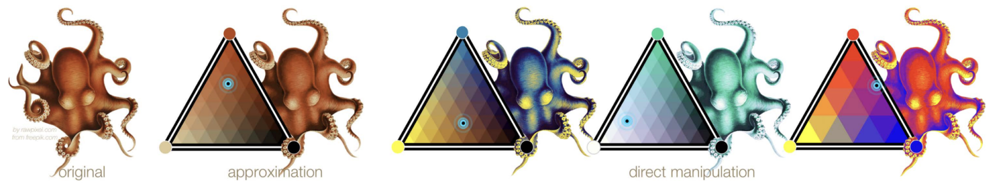
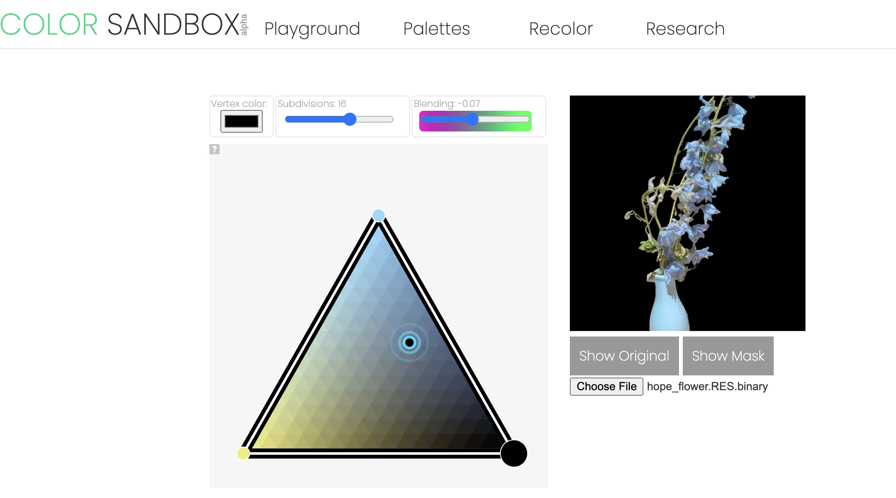

<p align="center">
    
</p>

# Color Triads

This is the codebase for the SIGGRAPH 2020 paper "Nonlinear Color Triads for Approximation, Learning and Direct Manipulation of Color Distributions" by Masha Shugrina, Amlan Kar,
Sanja Fidler and Karan Singh. **TL;DR:** a color triad is a compact color distribution
representation that can be fit to images or color samples and then used to interactively
control the entire color distribution, like in the teaser above. 
See [Project Page](https://colorsandbox.com/research/triads) and interactive demos at [colorsandbox.com](https://colorsandbox.com/recolor). 


## What this Code Contains

This code allows fitting color triads to images using two methods: 1) MATLAB-based optimization and 2) legacy tensorflow pre-trained checkpoint, ported to more modern tensorflow. The fitted color triads can be used
for recoloring images using interactive interface at [colorsandbox.com](https://colorsandbox.com/). 


## Fitting Color Triads to Images

The main script that runs over a whole directory of images is available here:
```
./colortriads/learn/tf/color/run_fitting_experiment.sh $TEST_IMG_DIR $OUTPUT_DIR
```
This script should be run twice, with a manual MATLAB step in between. 

### Step 0: Environment

:warning: This is a really old codebase written on python2.7 and old tensorflow, and MATLAB. We made a perfunctory
effort to have the inference run on newer python and tensorflow, but training is not implemented. Inference was tested with CPU only tensorflow running on Mac OS X (the model is tiny, so this is reasonably fast). To construct the environment run:
```
conda create --name triads python=3.10
conda activate triads
pip install -r requirements.txt
```

### Step 1: Fitting triads with a neural network (optional)
This script will first fit triads to images using a pre-trained neural network, which is worse than matlab optimization.
If you want to do that, first download and unzip the [checkpoint](https://drive.google.com/file/d/1bJu5Y_U3Jk6rlKbUyiLoeHDTqCi43521/view?usp=sharing) as follows:
```
mkdir models
unzip ~/Downloads/triad_network.zip -d models/.
```
Note that the port of the network from earlier version of tensorflow is not very 
careful and there could be issues. To fit triads with a neural network, run:
```
./colortriads/learn/tf/color/run_fitting_experiment.sh $TEST_IMG_DIR $OUTPUT_DIR
```
If you want to skip neural
network fitting, just run `mkdir $OUTPUT_DIR/palettes_deep` instead.


### Step 2: Fitting triads with optimization in MATLAB (best, but slow)

We tested this code with MATLAB 2024 version; you will require optimization toolbox. To run MATLAB color triad optimization of images in `$TEST_IMG_DIR`, open MATALB and run the following:
```
%% Navigate to "matlab" subdirectory 
doIncludes  %% run this
%% Naviate to matlab/color subdirectory
colorSailExperiments_Results(<test_img_dir>/, <output_dir>/, true);  %% fit triads
```
After this, your `$OUTPUT_DIR` will contain two subdirectories for fitted palettes, `palettes_deep` and `palettes`. 

### Step 3: Computing triad-image mapping to allow recoloring

The next step is computing the mapping from image pixels to color triad. To do that, simply re-run the same script:

```
./colortriads/learn/tf/color/run_fitting_experiment.sh $TEST_IMG_DIR $OUTPUT_DIR
```

Now, you will have `mappings` subdirectories containing the binary mapping files that can be used on colorsandbox.com.


## Recoloring UI

The result of step 3 above can be uploaded to a special url to allow recoloring the source images in our web GUI. Navigate to [special colorsandbox.com URL](https://colorsandbox.com/dev0a1b2c?bin=yes&no3d) and upload the `*.RES.binary` file from your `mappings` or `mappings_deep` subdirectory. You should now
be able to use the recoloring UI.

Note: the recoloring UI uses offset colors by default (i.e. it offsets errors by a per-pixel delta). In order to see only the triad colors
in the final image, open debug console in your broswer and type:
```
controller.repainter.use_delta_offset = false
```
<p align="center">
    
</p>

## License and Patents

While the codebase is released under MIT License, which does not include a patent grant. Keep in mind that this work is patented by the University of Toronto. Please file an issue if you would like to use color triads as a part of a commercial software application, and we will be happy to set up an agreement with the University of Toronto. 

"Method and System for Color Representation Generation." Shugrina et al. US Patent, Issued 2021. 

Use of codebase for research and evaluation purposes is encouraged. One-off artistic usage is also encouraged. 

## Citation

Please cite our paper if you find this codebase useful.

```
@article{shugrina2020nonlinear,
  title={Nonlinear color triads for approximation, learning and direct manipulation of color distributions},
  author={Shugrina, Maria and Kar, Amlan and Fidler, Sanja and Singh, Karan},
  journal={ACM Transactions on Graphics (TOG)},
  volume={39},
  number={4},
  pages={97--1},
  year={2020},
  publisher={ACM New York, NY, USA}
}
```
